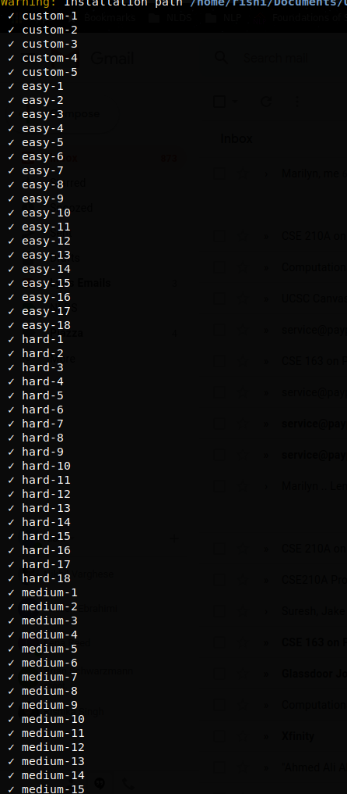

# Test scripts for CSE201A

Please merge your homework with the repepctive test script repository. You should include a *Makefile* 
such that running make in the root directory of your submission produces a file in the root directory.
The file, when executed, should read the strings via stdin and output the required content via stdout.

These test scripts are prepared based on [Sohum Banerjea's work](https://github.com/SohumB/cse210A-asgtest/tree/master).

## Instructions

### Assignment 1

**Assignment 1: ARITH** was implemented in Golang. No additional dependencies are required since all parsing is done using handwritten parser combinators.

The go installation instructions can be followed from https://golang.org/doc/install

To build the executable, simply run
```
make
```

The implementation of ARITH was largely inspired by Armin Heller's posts:
* https://medium.com/@armin.heller/parser-combinator-gotchas-2792deac4531
* https://medium.com/@armin.heller/parser-combinator-gotchas-2792deac4531

The key differences are that the original blog post evaluates the expressions inline instead of building a parse tree and in the assignment, some additional combinators are implemented.

### Assignment 2
**While** was implemented in Haskell using the stack build tool. The stack tool is able to select the right version of GHC automatically (as specified in the `stack.yaml` file), so no additional work is needed to setup the compiler.

Stack can be set up following the instructions from here: https://docs.haskellstack.org/en/stable/README/

The implementation of while was inspired by "Write You A Haskell" tutorial by Stephen Diehl. The section on Parsers covered how to implement components of an arithmetic expression parser. Parts of the paper "Applicative program with effects" helped me understand applicative functors to be used in this code. 

* http://dev.stephendiehl.com/fun/002_parsers.html
* https://citeseerx.ist.psu.edu/viewdoc/download?doi=10.1.1.114.1555&rep=rep1&type=pdf

The Boolean expressions, statement expressions, ternary operator, variable assignment and dereferencing and the interpreter were fully implemented by me.

### Assignment 4
**Small Step While** was implemented in Haskell was implemented in Haskell using the stack build tool. The stack tool is able to select the right version of GHC automatically (as specified in the `stack.yaml` file), so no additional work is needed to setup the compiler.

Stack can be set up following the instructions from here: https://docs.haskellstack.org/en/stable/README/

The definition of Show for pretty printing the AST was based off Prof. Flanagan's code in https://canvas.ucsc.edu/courses/32489/assignments/122288

The implementation of the evaluation, printing functions etc were fully by me.


### Test Case Coverage




